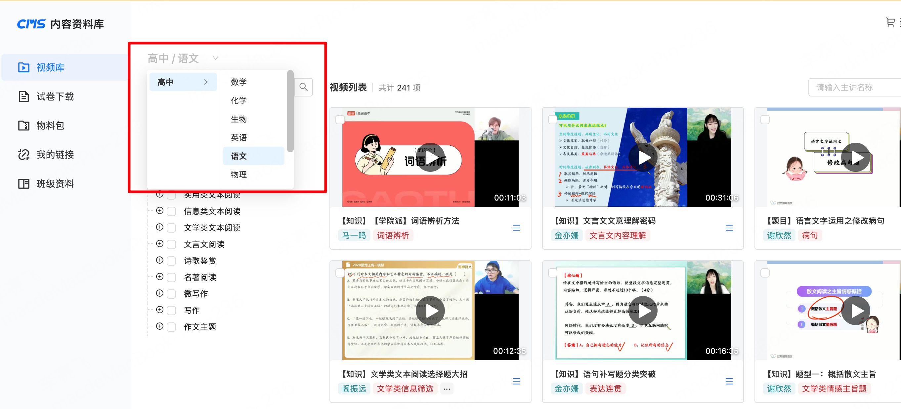

# 网页数据采集助手

这是一个 Chrome 扩展，用于采集网页上的树形结构数据并导出为 JSON 文件。

## 功能特点

- 支持通过快捷键（Command+Shift+S）或点击扩展图标开始采集
- 自动选择指定科目
- 采集树形结构的标签数据
- 将数据导出为本地 JSON 文件

## 安装方法

1. 打开 Chrome 浏览器，进入扩展程序页面（chrome://extensions/）
2. 开启右上角的"开发者模式"
3. 点击"加载已解压的扩展程序"
4. 选择本项目文件夹

## 使用方法

1. 打开目标网页
2. 点击扩展图标或使用快捷键（Command+Shift+S）开始采集
3. 在弹出窗口中输入要选择的科目（例如："数学"）
4. 点击"开始采集"按钮
5. 等待采集完成，数据将自动下载为 JSON 文件

## 开发说明

- manifest.json: 扩展配置文件
- popup.html: 扩展弹出界面
- popup.js: 弹出窗口交互逻辑
- content.js: 数据采集核心逻辑
- background.js: 文件下载处理

## 注意事项

- 导出视频之前，需要手动触发学科下拉列表 